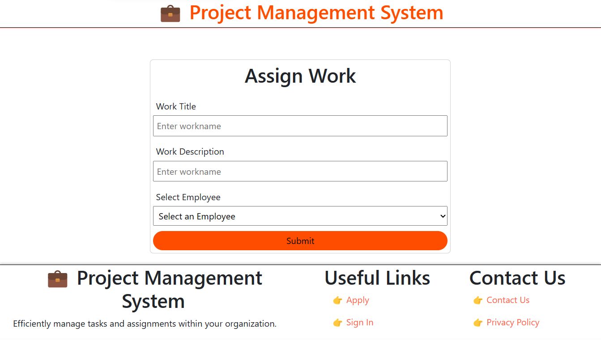

# Project Management System

The Project Management System is a web-based application designed to efficiently manage tasks and assignments within an organization. It provides a platform for employees to request, track, and complete tasks, while administrators oversee and manage the workflow.

## Features

- **Task Assignment**: Employees can request tasks or assignments through the system, providing task details such as description and due date.

- **Task Status Tracking**: Employees can update the status of their assigned tasks, transitioning from "Pending" to "Confirmed," "Working," and finally "Done." They can also cancel tasks when needed.

- **Application Submission**: External candidates can apply for available tasks by filling out a form, which is sent to administrators for review and approval.

- **Admin Approval**: Administrators review task applications, create employee profiles for approved candidates, and generate unique employee IDs.

- **Employee Profiles**: Employees have the ability to change their passwords and update their names through the system.

## User Roles

- **Employee**: Requests, updates, and completes tasks. Manages their profile.

- **Administrator**: Reviews and approves task applications, creates employee profiles, and oversees the system.

## Purpose

The purpose of this system is to streamline task management within the organization, making it easier for employees to request and track their assignments. It also facilitates the recruitment process by allowing external candidates to apply for tasks and become part of the organization when approved by administrators.

## Benefits

- Improved task allocation and tracking.

- Efficient onboarding of new employees.

- Enhanced communication between employees and administrators.

- Streamlined workflow management.

## Technology Stack

- Web-based application (HTML, CSS, JavaScript).

- Backend server (Node.js express).

- Database (mongoDB,firebase).

- User authentication and authorization system.

- Frontend framework (React).

## Getting Started

1. Clone this repository.

2. Install dependencies using `npm install` or `yarn`.

3. Configure your database and authentication system.

4. Run the application using `npm start` or `yarn start`.

## Screenshots

1. Home page. 

2. Admin Page. 
    

3. Employee page

    

## Check Out Our Demo Video

Click the image above to watch our demo video on YouTube.